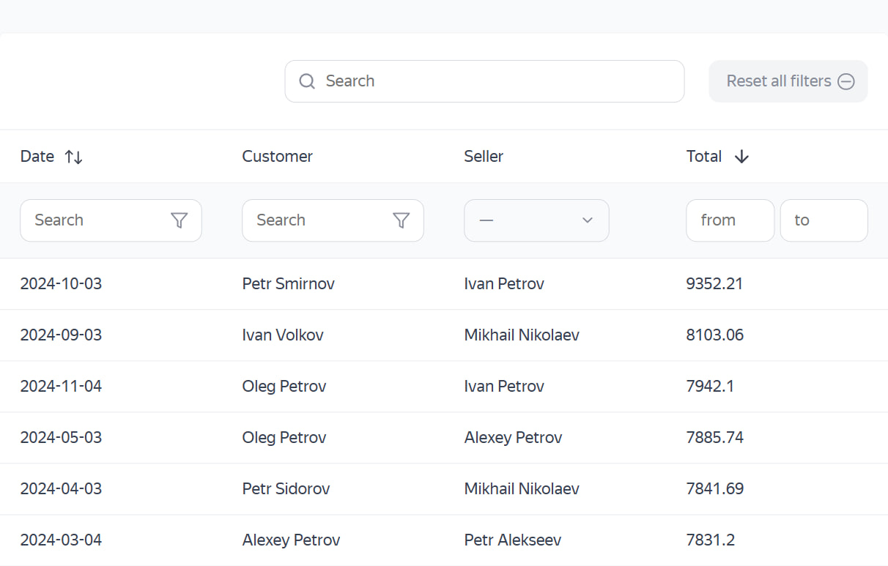

# Умная таблица

Интерактивная таблица продаж с серверным API. Поиск, фильтрация по продавцам, сортировка по столбцам и пагинация — все операции выполняются через запросы к серверу с передачей параметров через query string.

  

## Демо

**[https://vovchensky.github.io/smart-table/](https://vovchensky.github.io/smart-table/)**

## Технологии

- JavaScript (ES6+, async/await, fetch)
- Vite
- Работа с REST API (query-параметры, пагинация, фильтрация, сортировка)
- URLSearchParams для формирования запросов
- Кэширование запросов на клиенте
- Компонентная архитектура (pagination, filtering, searching, sorting)
- Promise.all для параллельных запросов
